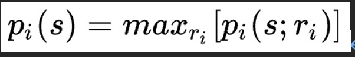

# 反事實遺憾最小化算法(CFR)

```

```

## 介紹： 

### Libratus：[新聞來源](https://ppfocus.com/0/sp8254d02.html)
&ensp;&ensp; 2017/01/30 由卡耐基梅隆大學開發的 AI 程式 *Libratus* 擊敗了人類頂級的職業撲克高手，贏得了20萬美金的獎金。儘管之前已經有 *Google DeepMind* 的 *AlphaGo* 擊敗職業圍棋手，但相對而言德州撲克對於 AI 來說卻是更大的挑戰，因為 AI 只能看到遊戲的部分資訊，因此不存在單一最優解。<br>
&ensp;&ensp; *Libratus* 並沒有使用神經網路，他主要是靠強化學習，其中共使用了三套系統的協作，本篇將著重於討論其第一層演算法「反事實遺憾最小化算法（CFR）」。

---

### 賽局理論：[資料來源](https://zh.wikipedia.org/zh-tw/%E5%8D%9A%E5%BC%88%E8%AE%BA)
&ensp;&ensp; **賽局理論** 是經濟學的的分支之一，是研究具有 **鬥爭或敵對性質** 現象的數學理論和方法，上述現象又稱為 *賽局行為*。<br>
&ensp;&ensp; 在這類行為中，參加鬥爭或競爭的各方各自具有不同的目標或利益。為了達到各自的目標和利益，各方必須考慮對手的各種可能的行動方案，並力圖選取對自己最為有利或最為合理的方案。

---

### 納什均衡： [資料來源](https://zh.wikipedia.org/wiki/%E7%BA%B3%E4%BB%80%E5%9D%87%E8%A1%A1)
&ensp;&ensp; 在 *賽局理論* 中，*納什均衡* 是指在包含兩個或以上參與者的非合作賽局中，假設每個參與者都知道其他參與者的均衡策略的情況下，沒有參與者可以透過改變自身策略使自身受益時的一個概念解。<br>
&ensp;&ensp; 在 *賽局理論* 中，如果每個參與者都選擇了自己的策略，並且沒有玩家可以透過改變策略而其他參與者保持不變而獲益，那麼當前的策略選擇的集合及其相應的結果構成了 *納什均衡* 。
<br>
&ensp;&ensp; *s* 為納什均衡點，其中：*Pi* 為參與者 *i* 的收穫，*Si* 代表所有參與者之策略，*ri* 代表參與者 *i* 的一種可能策略， ( *S* ; *ri* )指參與者 *i* 單方面改變策略為 *ri*。