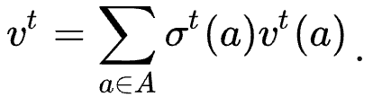
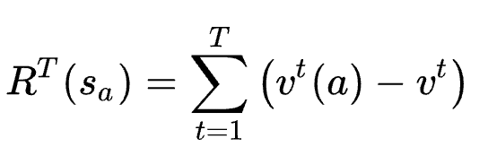
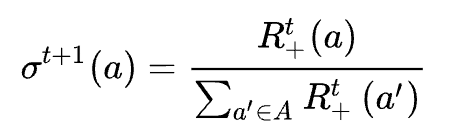
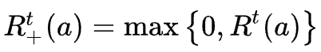

# 遺憾最小化算法(Regret Minimization)
* 本專案是研究他人專案，並加上自己的理解。
* [程式來源](https://gist.github.com/namoshizun/7a3b820b013f8e367e84c70b45af7c34)
* [圖片來源](https://zhuanlan.zhihu.com/p/410000789)
* 其他來源皆放於段落開頭

## 介紹：[納什均衡](#納什均衡-資料來源)、[賽局理論](#賽局理論資料來源)
&emsp;&emsp;相較於早期博弈中以頗析人性心理的玩法，現代博弈論已經與人工智慧逐漸結合，使用大數據作為賽局中決策的依據。**Google Deepmind AlphaGo** 與 **CMU Libratus**：前者是圍棋（大規模搜索空間的問題求解）、後者為德州撲克（非完美信息博弈問題求解），是兩個經典依靠數據算法的人工智慧戰勝職業玩家的例子。**Libratus** 中使用的第一層為「反事實遺憾最小化算法（CFR）」，而其中最重要的部分就屬「遺憾最小化算法（RM）」。<br>
&emsp;&emsp;*遺憾值* 的定義為「若我做了選擇 a 而非選擇 b，結果後悔的值為多少」。**遺憾最小化算法** 目前是計算非完整信息博弈第一選擇，其為一種最大限度減少 *遺憾值* 的算法，隨著賽局的進行不斷迭代，從過去的行為去更新接下的策略，最後會接近遊戲的最佳策略，也稱為「[納什均衡](#納什均衡-資料來源)」。

---

### 遺憾匹配（RM）：以猜拳為例
將猜拳定義為一種存在納什均衡的零和遊戲。*零和* 意指為所有動作的效用和為零，程式中定義效用矩陣如下：
```
class RPS:
    actions = ['ROCK', 'PAPER', 'SCISSORS']
    n_actions = 3
    utilities = pd.DataFrame([
        # ROCK  PAPER  SCISSORS
        [ 0,    -1,    1], # ROCK
        [ 1,     0,   -1], # PAPER
        [-1,     1,    0]  # SCISSORS
    ], columns=actions, index=actions)
```
* [玩家a:石頭 , 玩家b:剪刀]-> [玩家a效用：1（勝） , 玩家b效用：-1（敗）]。<br>

接下來將猜拳分為三個部分<N, A, u>：
* N 為玩家數（需大於1）
* A = {S, P, R} ：玩家可以做的動作，每位玩家都相同。
* u 是儲存玩家使用某策略的回報量，根據上面的例子，玩家a的u = 1 ; 玩家b的u = -1。
* 策略 **σᵢ(s)** 作為 玩家i 選擇動作 s 的機率。<br>

進行到第 t 回合時，選擇動作 a 的收益為：
<div  align="center">
    
</div>

假設 S 為一個候選策略集合，$s_a$ 表示該回合選擇動作 a ，其遺憾值為：
<div  align="center">
    
</div>

```
def regret(self, my_action, opp_action):
    result = RPS.utilities.loc[my_action, opp_action]
    facts = RPS.utilities.loc[:, opp_action].values
    regret = facts - result
    self.regret_sum += regret
```

在 t+1 輪，動作 a 被選擇的機率為：

```
def update_strategy(self):
    self.strategy = np.copy(self.regret_sum)
    self.strategy[self.strategy < 0] = 0  # reset negative regrets to zero

    summation = sum(self.strategy)
    if summation > 0:
        # normalise
        self.strategy /= summation

def regret(self, my_action, opp_action):
    result = RPS.utilities.loc[my_action, opp_action]
    facts = RPS.utilities.loc[:, opp_action].values
    regret = facts - result
    self.regret_sum += regret

def action(self, use_avg=False):
    strategy = self.avg_strategy if use_avg else self.strategy
    return np.random.choice(RPS.actions, p=strategy)
```

<div  align="center">
    
</div>

* 其中若累積的遺憾值小於0，可以採取任何策略
<div  align="center">
    
</div>

```
self.strategy[self.strategy < 0] = 0
```

---
 
### 納什均衡： [資料來源](https://veracityconsultant.com.tw/what-is-game-theory/)
納什均衡最具代表性的的例子就是「[囚途困境](https://www.youtube.com/watch?v=svoKR8mfNfU)」：<br>
&emsp;&emsp;警方逮捕A、B兩名嫌疑犯，但沒有足夠證據指控二人有罪。於是警方分開囚禁嫌疑犯，分別和二人見面，並向雙方提供以下相同的選擇：
* 若一人認罪並且指證對方（背叛者），而對方（遭背叛者）保持沉默，背叛者將立刻釋放，遭背叛者將判監10年。
* 若二人都保持沉默，則二人同樣判刑1年。
* 若二人都互相背叛，則二人同樣判監8年。
<div  align="center">
    
</div>

整理A、B囚犯收益比如下：<br>
* AB囚犯一起認罪且指證對方，收益比為（-8,-8）
* A指認，最佳收益比為（0,-10）
* B指認，最佳收益比為（-10,0）
* AB囚犯都沈默，收益比為（-1,-1）

&emsp;&emsp;使用賽局矩陣來表示這場賽局：<br>
<div  align="center">
    
</div>

&emsp;&emsp;若*B囚犯*選擇「坦白」，那麼*Ａ囚犯*最佳解就是「坦白」，否則最慘將面臨10年的徒刑。 <br>
<div  align="center">
    
</div>

&emsp;&emsp;如果*Ｂ囚犯*選擇抗拒，那麼*Ａ囚犯*最佳解也是「坦白」，可以完全不用坐牢！<br>
<div  align="center">
    
</div>

&emsp;&emsp;如果*Ａ囚犯*選擇坦白，那麼*Ｂ囚犯*最佳解就是也跟者「坦白」，否則最慘將面臨10年的徒刑。<br>
<div  align="center">
    
</div>

&emsp;&emsp;如果*Ａ囚犯*選擇抗拒，那麼*Ｂ囚犯*最佳解也是「坦白」，可以完全逃過牢獄之災。<br>
<div  align="center">
    
</div>

&emsp;&emsp;在這個例子中，兩個歹徒都認罪就是**納什均衡**點，在納什均衡的情況下，沒人擁有改變決策的動力，因為只要改變決策就會使自己的收益減少。納什均衡不一定是賽局中的最優解，關鍵在於能否信任或掌握對方的判斷。能掌握或與對方預先共謀，便能在賽局中取得雙贏；反之則是兩敗俱傷。

---

### 賽局理論：[資料來源](https://veracityconsultant.com.tw/what-is-game-theory/)
&emsp;&emsp;*RM* 中更新策略的基礎是來自**賽局理論**，其主要目的是將賽局公式化，並研究它們的最佳化策略，探討之間的相互作用（遊戲或者賽局），其有5個要點：<br>
* 玩家：玩家總數大於1人。
* 策略：玩家根據當下情況而決定的動作。
* 回饋：玩家執行每個可能動作後的「得」或「失」。
* 最佳反應：針對對手的策略選擇最有利的反應。
* 均衡：均衡就是賽局的最後結果，又稱為「納什均衡」。<br>

&emsp;&emsp;在這類行為中，參加鬥爭或競爭的各方各自具有不同的目標或利益。為了達到各自的目標和利益，各方必須考慮對手的各種可能的行動方案，並力圖選取對自己最為有利或最為合理的方案。

---

