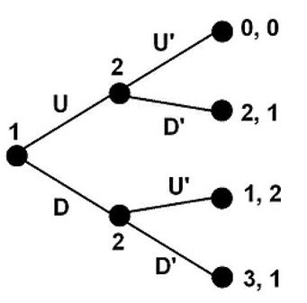
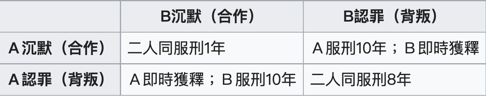
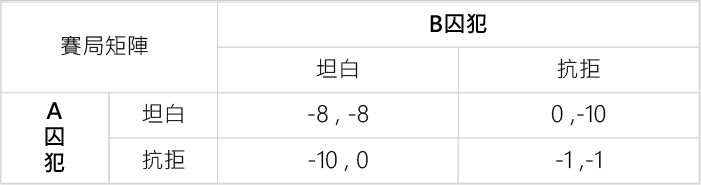
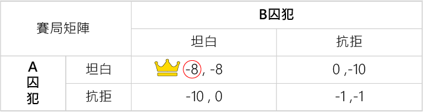
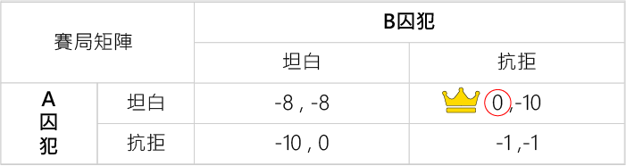
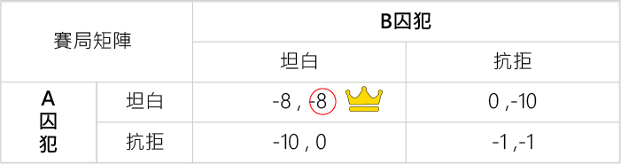
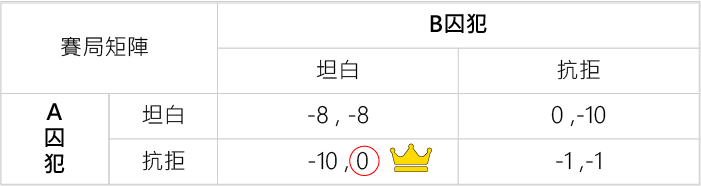

# 反事實遺憾最小化算法(CFR)

```

```

## 介紹：[Libratus](#Libratus新聞來源)、[納什均衡](#納什均衡-資料來源)、[賽局理論](#賽局理論資料來源)

### Libratus：[新聞來源](https://ppfocus.com/0/sp8254d02.html)
&emsp;&emsp;2017/01/30 由卡耐基梅隆大學開發的 AI 程式 *Libratus* 擊敗了人類頂級的職業撲克高手，贏得了20萬美金的獎金。儘管先前已經有 *Google DeepMind* 的 *AlphaGo* 擊敗職業圍棋手，但相對而言德州撲克對於 AI 來說卻是更大的挑戰，因為 AI 只能看到遊戲的部分資訊，不存在單一最優解。<br>
&emsp;&emsp;而 *Libratus* 並沒有使用神經網路，他主要是靠強化學習，其中共使用了三套系統的協作，本篇將著重於討論其第一層演算法「反事實遺憾最小化算法（CFR）」。<br>

&emsp;&emsp;當一局賽局進行中，我們需要根據不同的對手、不同的情況做出不同的[決策](/Midterm_Project/src/README.md#決策)。*CFR*透過「遺憾值」來學習不同情況時應該做出什麼決策。<br>
&emsp;&emsp;[「遺憾值」](/Midterm_Project//src/README.md#更新遺憾值)其本質的思路就是在之前的遊戲情況中，我們制定的策略哪一項的後悔值最大，下一次遊戲就偏向選擇該行為。以猜拳為例：若我們進行了 n（程式中n = 10000) 次遊戲，將所有回合我們沒有選擇某個策略的後悔值相加歸化，就能得到制定策略的概率分佈。<br>
&emsp;&emsp;若將賽局生成為一顆狀態樹，對樹的每一節點都初始化為一個決策，每次都走狀態樹的一條邊，後根據遊戲的結果來[更新相關節點的策略](/Midterm_Project/src/README.md#策略更新)，當 CFR 進行了許多次賽局後，這個狀態樹的每條路徑都被遍歷了很多次，每個節點的策略都被更新趨於[納什均衡](#納什均衡-資料來源)了。<br>
<div  align="center">
    
</div>

### 納什均衡： [資料來源](https://veracityconsultant.com.tw/what-is-game-theory/)
納什均衡最具代表性的的例子就是「[囚途困境](https://www.youtube.com/watch?v=svoKR8mfNfU)」：<br>
&emsp;&emsp;警方逮捕A、B兩名嫌疑犯，但沒有足夠證據指控二人有罪。於是警方分開囚禁嫌疑犯，分別和二人見面，並向雙方提供以下相同的選擇：
* 若一人認罪並且指證對方（背叛者），而對方（遭背叛者）保持沉默，背叛者將立刻釋放，遭背叛者將判監10年。
* 若二人都保持沉默，則二人同樣判刑1年。
* 若二人都互相背叛，則二人同樣判監8年。
<div  align="center">
    
</div>

整理A、B囚犯收益比如下：<br>
* AB囚犯一起認罪且指證對方，收益比為（-8,-8）
* A指認，最佳收益比為（0,-10）
* B指認，最佳收益比為（-10,0）
* AB囚犯都沈默，收益比為（-1,-1）

&emsp;&emsp;使用賽局矩陣來表示這場賽局：<br>
<div  align="center">
    
</div>

&emsp;&emsp;若*B囚犯*選擇「坦白」，那麼*Ａ囚犯*最佳解就是「坦白」，否則最慘將面臨10年的徒刑。 <br>
<div  align="center">
    
</div>

&emsp;&emsp;如果*Ｂ囚犯*選擇抗拒，那麼*Ａ囚犯*最佳解也是「坦白」，可以完全不用坐牢！<br>
<div  align="center">
    
</div>

&emsp;&emsp;如果*Ａ囚犯*選擇坦白，那麼*Ｂ囚犯*最佳解就是也跟者「坦白」，否則最慘將面臨10年的徒刑。<br>
<div  align="center">
    
</div>

&emsp;&emsp;如果*Ａ囚犯*選擇抗拒，那麼*Ｂ囚犯*最佳解也是「坦白」，可以完全逃過牢獄之災。<br>
<div  align="center">
    
</div>

&emsp;&emsp;在這個例子中，兩個歹徒都認罪就是**納什均衡**點，在納什均衡的情況下，沒人擁有改變決策的動力，因為只要改變決策就會使自己的收益減少。納什均衡不一定是賽局中的最優解，關鍵在於能否信任或掌握對方的判斷。能掌握或與對方預先共謀，便能在賽局中取得雙贏；反之則是兩敗俱傷。

### 賽局理論：[資料來源](https://veracityconsultant.com.tw/what-is-game-theory/)
&emsp;&emsp;*CFR* 中更新策略的基礎是來自**賽局理論**，其主要目的是將賽局公式化，並研究它們的最佳化策略，探討之間的相互作用（遊戲或者賽局），其有5個要點：<br>
* 玩家：玩家總數大於1人。
* 策略：玩家根據當下情況而決定的動作。
* 回饋：玩家執行每個可能動作後的「得」或「失」。
* 最佳反應：針對對手的策略選擇最有利的反應。
* 均衡：均衡就是賽局的最後結果，又稱為「納什均衡」。<br>

&emsp;&emsp;在這類行為中，參加鬥爭或競爭的各方各自具有不同的目標或利益。為了達到各自的目標和利益，各方必須考慮對手的各種可能的行動方案，並力圖選取對自己最為有利或最為合理的方案。

---

## CFR
將猜拳定義為一種存在納什均衡的零和遊戲，*零和* 意指為所有動作的效用和為零，程式中定義效用矩陣如下：
```
class RPS:
    actions = ['ROCK', 'PAPER', 'SCISSORS']
    n_actions = 3
    utilities = pd.DataFrame([
        # ROCK  PAPER  SCISSORS
        [ 0,    -1,    1], # ROCK
        [ 1,     0,   -1], # PAPER
        [-1,     1,    0]  # SCISSORS
    ], columns=actions, index=actions)
```
* （玩家a:石頭 , 玩家b:剪刀）-> (玩家a效用：1 , 玩家b效用：-1)。<br>

接下來將猜拳分為三個部分<N, A, u>：
* N 為玩家（需大於1）
* S = S, P, R 為玩家可以做的動作，每位玩家都相同
* A = S1 * S2 * ... * Sn 為所有可能的策略集合{(剪刀,剪刀), (剪刀,石頭)...(布,布)}。 (德州撲克的策略集合達到上千萬種)
* U是一個策略