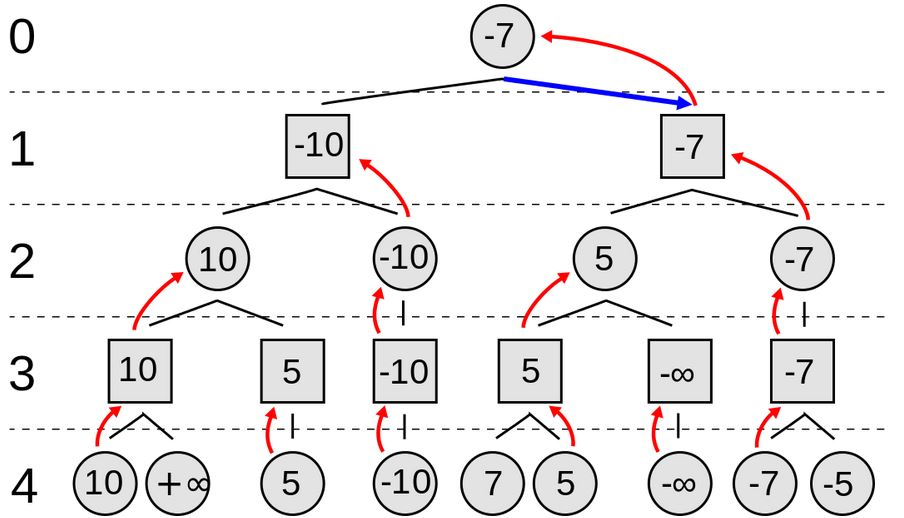

# 人工智慧第八週筆記
## MIN-MAX
* [MIN-MAX](http://programmermagazine.github.io/201407/htm/focus3.html)
* 在下棋的時候，如果要打敗對手，必須考量讓自己得分最多，且讓對手得分最少，Min-Max 正是根據這樣的想法而設計出來的。必須注意的是，當電腦要下一子之前，當然會下讓自己得分最多的那一格，但是這很容易會落入對手的陷阱，因為得分最多的那一格很可能接下來失分更多。於是、一個合理的想法是將所有層次分為「敵我雙方」兩類，我方下的那層得分越多越好，而對方下的那層失分越少越好。

## code
* gomoku.py
```py
'''
五子棋遊戲，單機命令列版 -- 作者：陳鍾誠

人對人下  ：python gomoku.py P P
人對電腦  ：python gomoku.py P C
電腦對電腦：python gomoku.py C C
'''

import sys
import time
#  棋盤物件
class Board:

    def __init__(self, rMax, cMax):
        self.m = [None] * rMax
        self.rMax = rMax
        self.cMax = cMax
        for r in range(rMax):
            self.m[r] = [None] * cMax
            for c in range(cMax):
                self.m[r][c] = '-'

    #  將棋盤格式化成字串
    def __str__(self):
        b = []
        b.append('  0 1 2 3 4 5 6 7 8 9 a b c d e f')
        for r in range(self.rMax):
            b.append('{:x} {:s} {:x}'.format(r, ' '.join(self.m[r]), r))
            # r.toString(16) + ' ' + self.m[r].join(' ') + ' ' + r.toString(16) + '\n'

        b.append('  0 1 2 3 4 5 6 7 8 9 a b c d e f')
        return '\n'.join(b)

    #  顯示棋盤
    def show(self):
        print(str(self))

#  以下為遊戲相關資料與函數
#  zero = [ 0, 0, 0, 0, 0]
#  inc  = [-2,-1, 0, 1, 2]
#  dec  = [ 2, 1, 0,-1,-2]
z9 = [0, 0, 0, 0, 0, 0, 0, 0, 0]
i9 = [-4, -3, -2, -1, 0, 1, 2, 3, 4]
d9 = [4, 3, 2, 1, 0, -1, -2, -3, -4]
z5 = [0, 0, 0, 0, 0]
i2 = i9[2:-2]
d2 = d9[2:-2]

#  檢查在 (r, c) 這一格，規則樣式 (dr, dc) 是否被滿足
#  dr, dc 的組合可用來代表「垂直 | , 水平 - , 下斜 \ , 上斜 /」。
def patternCheck(board, turn, r, c, dr, dc):
    for i in range(len(dr)):
        tr = round(r + dr[i])
        tc = round(c + dc[i])
        if tr < 0 or tr >= board.rMax or tc < 0 or tc >= board.cMax:
            return False
        v = board.m[tr][tc]
        if (v != turn):
            return False
    
    return True

#  檢查是否下 turn 這個子的人贏了。
def winCheck(board, turn):
    win = False
    tie = True
    for r in range(board.rMax):
        for c in range(board.cMax):
            tie = False if board.m[r][c] == '-' else tie
            win = True if patternCheck(board, turn, r, c, z5, i2) else win #  水平 -
            win = True if patternCheck(board, turn, r, c, i2, z5) else win #  垂直 |
            win = True if patternCheck(board, turn, r, c, i2, i2) else win #  下斜 \
            win = True if patternCheck(board, turn, r, c, i2, d2) else win #  上斜 /
    if (win):
        print('{} 贏了！'.format(turn))  #  如果贏了就印出贏了
        sys.exit() #  然後離開。

    if (tie):
        print('平手')
        sys.exit(0) #  然後離開。

    return win

attackScores = [0, 3, 10, 30, 100, 500]
guardScores = [0, 2, 9, 25, 90, 400]
attack = 1
guard = 2

def getScore(board, r, c, turn, mode):
    score = 0
    mScores = attackScores if mode == attack else guardScores
    board.m[r][c] = turn
    for start in range(5):
        for len1 in reversed(range(5)):
            length = len1 + 1
            zero = z9[start: start + length]
            inc  = i9[start: start + length]
            dec  = d9[start: start + length]
            if patternCheck(board, turn, r, c, zero, inc):
                score += mScores[length] #  得分：垂直 |
            if patternCheck(board, turn, r, c, inc, zero):
                score += mScores[length] #  得分：水平 -
            if patternCheck(board, turn, r, c, inc, inc):
                score += mScores[length] #  得分：下斜 \
            if patternCheck(board, turn, r, c, inc, dec):
                score += mScores[length] #  得分：上斜 /

    if r == 0 or r == board.rMax:
        score = score - 1
    if c == 0 or c == board.cMax:
        score = score - 1
    board.m[r][c] = '-'
    return score

def peopleTurn(board, turn):
    try:
        xy = input('將 {} 下在: '.format(turn))
        r = int(xy[0], 16) #  取得下子的列 r (row)
        c = int(xy[1], 16) #  取得下子的行 c (column)
        if r < 0 or r > board.rMax or c < 0 or c > board.cMax: #  檢查是否超出範圍
            raise Exception('(row, col) 超出範圍!') #  若超出範圍就丟出例外，下一輪重新輸入。
        if board.m[r][c] != '-': #  檢查該位置是否已被佔據
            raise Exception('({}{}) 已經被佔領了!'.format(xy[0], xy[1])) #  若被佔據就丟出例外，下一輪重新輸入。
        board.m[r][c] = turn #  否則、將子下在使用者輸入的 (r,c) 位置
    except Exception as error:
        print(error)
        peopleTurn(board, turn)

def computerTurn(board, turn):
    best = {'r': 0, 'c': 0, 'score': -1}
    for r in range(board.rMax):
        for c in range(board.cMax):
            if (board.m[r][c] != '-'):
                continue
            enermy = 'o' if turn == 'x' else 'x'
            attackScore = getScore(board, r, c, turn, attack)  #  攻擊分數
            guardScore = getScore(board, r, c, enermy, guard)   #  防守分數
            score = attackScore + guardScore
            if r==8 and c==8: # 電腦若是第一手應該下 (8,8)
                score += 1
            if score > best['score']:
                best['r'] = r
                best['c'] = c
                best['score'] = score

    board.m[best['r']][best['c']] = turn #  將子下在分數最高的位置

def chess(o, x):
    b = Board(16, 16) #  建立棋盤
    b.show()            #  顯示棋盤
    while (True):
        if o.upper()=='P':
            peopleTurn(b, 'o')
        else:
            computerTurn(b, 'o')
        b.show()         #  顯示棋盤現況
        winCheck(b, 'o') #  檢查下了這子之後是否贏了！
        time.sleep(2)
        if x.upper()=='P':
            peopleTurn(b, 'x')
        else:
            computerTurn(b, 'x')
        b.show()
        winCheck(b, 'x')
        time.sleep(2)

o, x = sys.argv[1], sys.argv[2]
chess(o, x)
```