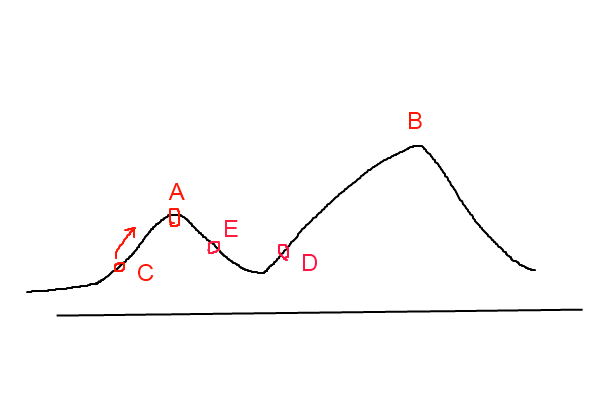

# 第四週課堂筆記

## 模擬退火法
* 與爬山演算法相同都為貪心演算法，不同處於模擬退火法加入了隨機因素。
* 先給一個高溫，讓自由度高一點(克服爬山演算法只能往下走的問題)，使程式能夠跨越小山丘找到更好的解。


設定初始解為 0，先搜尋至局部最佳解 A ，模擬退火法會以一定的概率接受往右（E）的移動，也許經過幾次這樣的不是區域性最優的移動後會到達 B 點，於是就跳出了局部（全域）最大值。

* 程式範例：`s 是值， maxGens 是最大次數，maxFails 是最多錯誤次數`
```py
def hillClimbing(s, maxGens, maxFails):   # 爬山演算法的主體函數
    print("start: ", s.str())             # 印出初始解
    fails = 0                             # 失敗次數設為 0
    # 當代數 gen<maxGen，且連續失敗次數 fails < maxFails 時，就持續嘗試尋找更好的解。
    for gens in range(maxGens):
        snew = s.neighbor()               #  取得鄰近的解
        sheight = s.height()              #  sheight=目前解的高度
        nheight = snew.height()           #  nheight=鄰近解的高度
        if (nheight >= sheight):          #  如果鄰近解比目前解更好
            print(gens, ':', snew.str())  #    印出新的解
            s = snew                      #    就移動過去
            fails = 0                     #    移動成功，將連續失敗次數歸零
        else:                             #  否則
            fails = fails + 1             #    將連續失敗次數加一
        if (fails >= maxFails):
            break
    print("solution: ", s.str())          #  印出最後找到的那個解
    return s                              #    然後傳回。
```